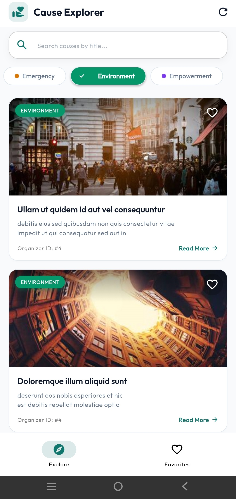
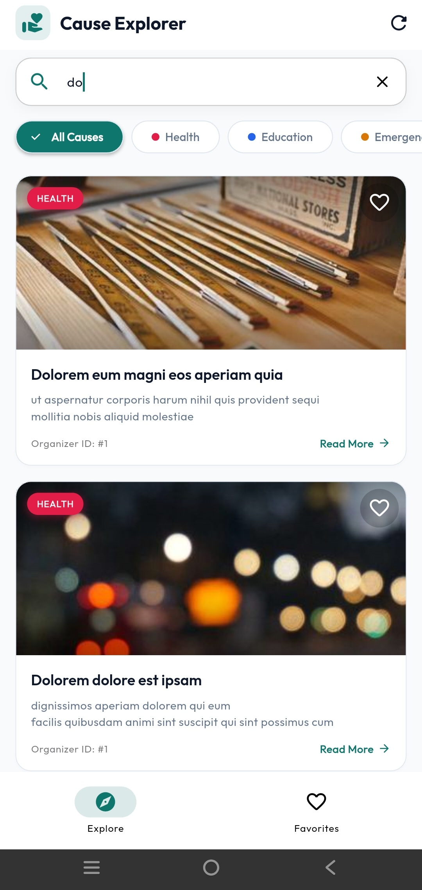
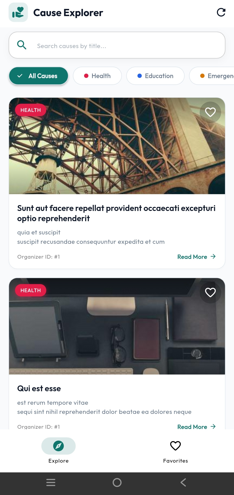
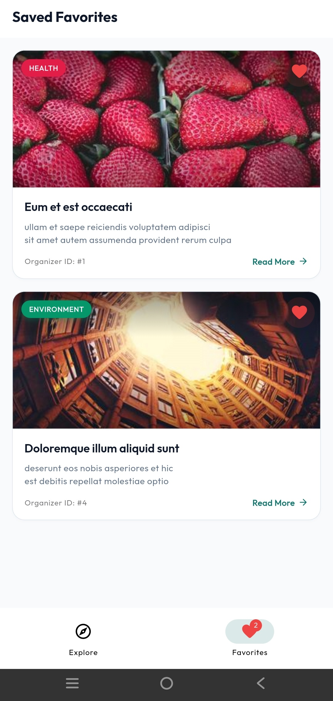
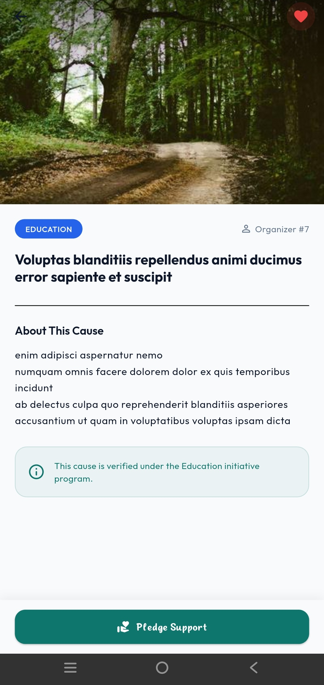

# 🌍 Cause Explorer - Flutter take-home assessment for Bayana Flutter Developer Intern role

**Cause Explorer** is a Flutter application built using **Flutter 3.x**, **Riverpod 2.x**, **Dio**, **GoRouter**, and **Clean Architecture**. It fetches social causes from an API endpoint, derives dynamic categories and hero image URLs, and provides interactive search, category filtering, favorites management, detail views, and robust error/loading/empty states.

---
## Screenshots

| Home | Search |
|------|---------|
|  |  |

| Filter | Favorites |
|------|---------|
|  |  |

| Detail |
|---------|
|  |

## 🚀 How to Run the Project

### Prerequisites
- **Flutter SDK**: `>=3.0.0 <4.0.0`
- **Dart SDK**: `>=3.0.0`
- An active emulator, simulator, or browser target.

### Step-by-Step Setup

1. **Clone or navigate to the project directory**:
   ```bash
   cd cause_explorer
   ```

2. **Fetch Flutter dependencies**:
   ```bash
   flutter pub get
   ```

3. **Run static code analysis**:
   ```bash
   flutter analyze
   ```

4. **Run automated unit & provider tests**:
   ```bash
   flutter test
   ```

5. **Launch the application**:
   - On a connected mobile device or emulator:
     ```bash
     flutter run
     ```
   - On Chrome / Web:
     ```bash
     flutter run -d chrome
     ```

---

## ⚡ State Management Choice & Justification

### Which State Management Tool Was Chosen?
We chose **Riverpod 2.x** (`flutter_riverpod`) as the core state management solution for the application.

### Why Riverpod?

1. **Compile-Time Safety & No `BuildContext` Dependency**:
   Unlike standard `Provider`, Riverpod does not depend on the Flutter widget tree or `BuildContext` to read or listen to state. This eliminates runtime `ProviderNotFoundException`s and allows state controllers and business logic to be tested in pure Dart test suites without mocking `BuildContext`.

2. **Declarative & Reactive Derived State**:
   The app relies heavily on derived state (`filteredCausesProvider`, `favoriteCausesProvider`). Using Riverpod's `ref.watch()`, derived providers automatically recalculate whenever search text (`searchQueryProvider`), category filters (`selectedCategoryProvider`), or network data (`causesAsyncNotifierProvider`) change. This prevents state duplication and keeps UI code clean.

3. **Built-in Async Data Lifecycle (`AsyncValue`)**:
   `AsyncNotifier` handles asynchronous data states seamlessly by encapsulating `AsyncData`, `AsyncLoading`, and `AsyncError`. This allows UI components to reactively display shimmer loading skeletons, error retry cards, and pull-to-refresh indicators with minimal boilerplate.

4. **Micro-Rebuild Optimization with `.select()`**:
   Widgets can subscribe to specific state slices. For example, favorite toggle buttons use:
   ```dart
   ref.watch(favoritesNotifierProvider.select((set) => set.contains(causeId)));
   ```
   This ensures that toggling a favorite state on a single card only triggers a rebuild for that specific card, optimizing rendering performance.

5. **Exceptional Testability**:
   Riverpod providers can easily be overridden in test suites using `ProviderContainer` or `ProviderScope(overrides: [...])`, allowing data sources and state containers to be mocked cleanly during unit and widget tests.

---

## 📁 Project Folder Structure & Architectural Rationale

### Folder Structure
The codebase follows a **Feature-First + Clean Architecture** structure:

```
lib/
├── core/
│   ├── constants/        # ApiConstants & AppCategories derivation logic
│   ├── network/          # Custom DioClient with interceptors & ApiException hierarchy
│   ├── router/           # GoRouter with StatefulShellRoute bottom navigation
│   └── theme/            # Material 3 design system & custom typography
└── features/
    └── causes/
        ├── domain/       # Core business entities & repository contracts
        │   ├── models/   # Immutable Cause entity
        │   └── repositories/ # CauseRepository interface
        ├── data/         # Data sources, JSON DTOs, & repository implementations
        │   ├── datasources/  # CauseRemoteDataSource (Dio HTTP requests)
        │   ├── models/       # CauseDto (JSON mapping & domain conversion logic)
        │   └── repositories/ # CauseRepositoryImpl
        └── presentation/ # UI screens, custom widgets, & Riverpod state controllers
            ├── providers/ # AsyncNotifiers, StateProviders, & computed derived providers
            ├── screens/   # MainNav, CauseList, Favorites, & CauseDetail screens
            └── widgets/   # CauseCard, FilterChips, SearchBar, Skeleton, Error, & Empty states
```

### Why This Folder Structure?

- **Separation of Concerns**: The `domain` layer has zero dependencies on Flutter frameworks, network clients (`Dio`), or database drivers. Core business entities and rules remain completely isolated.
- **Feature Modularity & Scalability**: Code is grouped by feature (`features/causes/`). Adding new features in the future (e.g., `features/donations/`, `features/user_profile/`) can be accomplished without touching or cluttering existing feature files.
- **Layer Independence**: The `presentation` layer only communicates with the `domain` layer (interfaces and entities), and the `data` layer handles serialization specifics (`CauseDto`). If backend JSON keys change, only `CauseDto` needs modification—domain and presentation layers remain unaffected.

---

## 🏷️ Category-Mapping Logic

### Source API
The app consumes cause data from `https://jsonplaceholder.typicode.com/posts`, where each raw JSON item contains `id`, `userId`, `title`, and `body`.

### Category Derivation Formula
To assign meaningful social categories to causes, the app maps the API's `userId` field to a fixed list of 5 categories: `["Health", "Education", "Emergency", "Environment", "Empowerment"]`.

$$\text{Category Index} = (\text{userId} - 1) \pmod{\text{categories.length}}$$

```dart
static const List<String> categories = [
  'Health',
  'Education',
  'Emergency',
  'Environment',
  'Empowerment',
];

static String deriveCategoryFromUserId(int userId) {
  if (userId <= 0) return categories[0];
  final index = (userId - 1) % categories.length;
  return categories[index];
}
```

#### Mapping Examples:
- `userId = 1` $\rightarrow (1 - 1) \bmod 5 = 0 \rightarrow$ **Health**
- `userId = 2` $\rightarrow (2 - 1) \bmod 5 = 1 \rightarrow$ **Education**
- `userId = 3` $\rightarrow (3 - 1) \bmod 5 = 2 \rightarrow$ **Emergency**
- `userId = 4` $\rightarrow (4 - 1) \bmod 5 = 3 \rightarrow$ **Environment**
- `userId = 5` $\rightarrow (5 - 1) \bmod 5 = 4 \rightarrow$ **Empowerment**
- `userId = 6` $\rightarrow (6 - 1) \bmod 5 = 0 \rightarrow$ **Health** *(loops deterministically)*

### Hero Image URL Mapping
Images are dynamically assigned using Picsum Photos with the cause `id` as the random seed:
```dart
static String getImageUrl(int id) => 'https://picsum.photos/seed/$id/400/300';
```

### DTO to Domain Transformation
The `CauseDto.toDomain()` method encapsulates the category derivation, title capitalization, and image URL generation during JSON parsing, returning a clean, immutable `Cause` domain entity.

---

## 🔮 Future Improvements & What I'd Add with More Time

If given additional time to extend the application, the following enhancements would be prioritized:

1. **Local Data Persistence**:
   - Integrate `shared_preferences` or `hive` / `isar` to persist user favorited causes across app restarts and device reboots.

2. **Offline Mode & Caching Layer**:
   - Implement a local cache (e.g. SQLite via `sqflite` or Hive) within `CauseRepositoryImpl` to serve cached causes when the device is offline, with automatic background cache revalidation when network connection is restored.

3. **Pagination & Infinite Scrolling**:
   - Add page-based or cursor-based chunked fetching in `CauseRemoteDataSource` and `causesAsyncNotifierProvider` to support infinite scrolling for large datasets.

4. **Debounced Search & Server-Side Querying**:
   - Implement search input debouncing (e.g. 300ms delay) to avoid over-filtering on every keystroke, and update the repository layer to support server-side query parameters.

5. **Visual Golden & Integration Testing**:
   - Expand the current test suite with widget golden tests (visual regression testing) and full end-to-end integration tests using `integration_test`.

6. **Hero Animations & Micro-Interactions**:
   - Add Flutter `Hero` widget transitions between cause list cards and the detailed view, along with interactive micro-animations for liking/favoriting causes.

7. **Deep Linking & Localization (i18n)**:
   - Configure custom scheme and HTTPS deep links via `GoRouter` (e.g., `causeexplorer://cause/42`) and add internationalization support with `flutter_localizations`.

---

## 🧪 Testing

Run all automated unit and provider tests:

```bash
flutter test
```

### Test Coverage Summary:
- **Category Formula Unit Tests**: Verifies mapping mathematical correctness across regular indices, edge cases ($userId \le 0$), and multi-cycle loops.
- **DTO Conversion Tests**: Verifies `CauseDto.toDomain()` title capitalization, category mapping, and image URL generation.
- **Riverpod Provider Tests**: Tests `AsyncNotifier` network fetching, filter query reactivity, category filtering, and `FavoritesNotifier` state toggling using a custom `ProviderContainer`.

---

